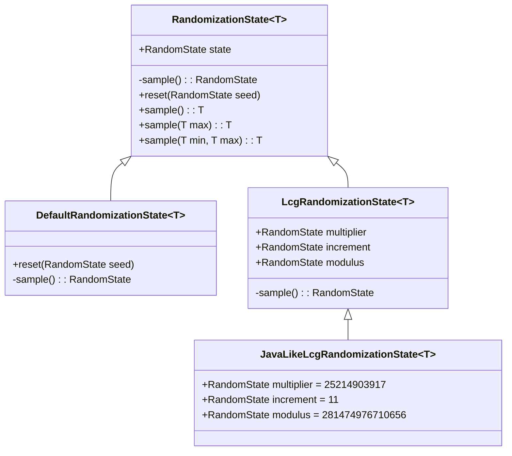
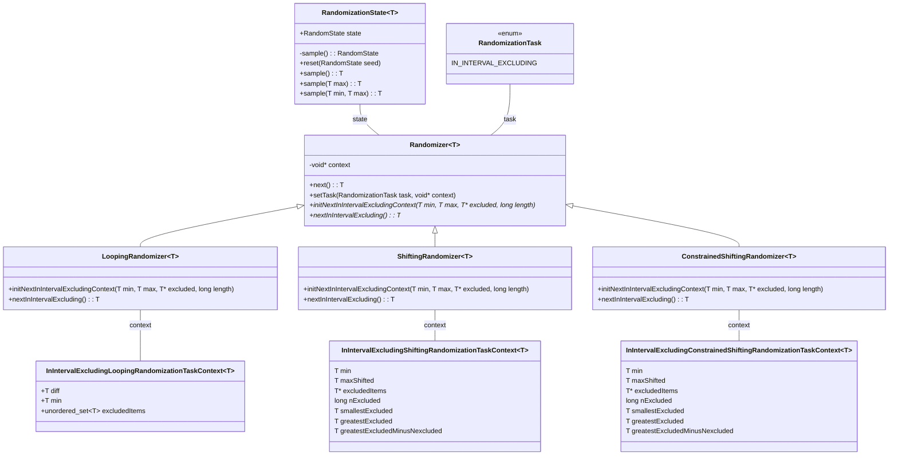
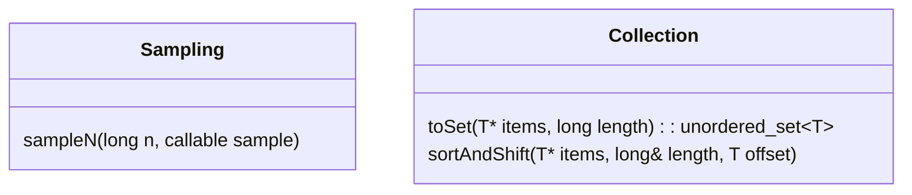
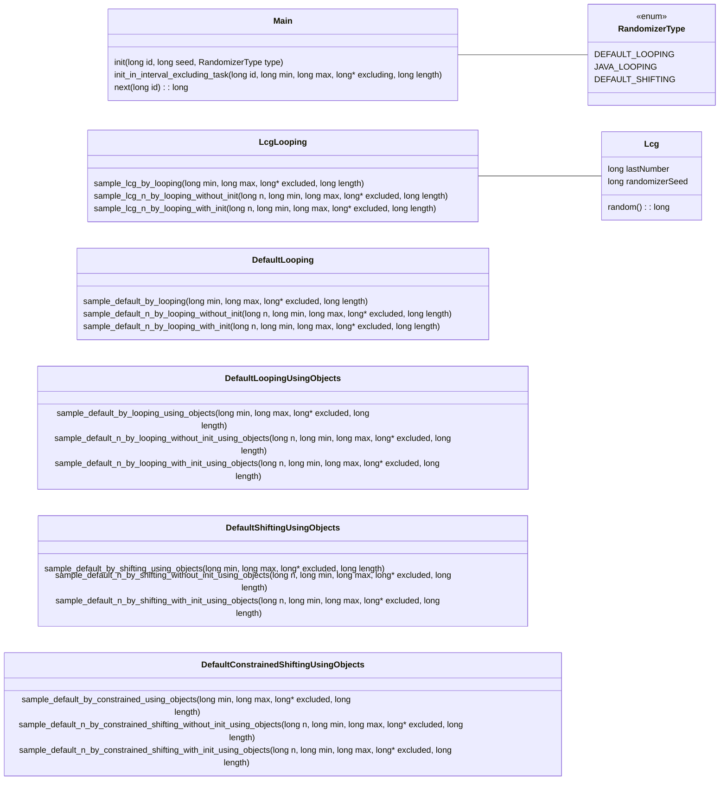
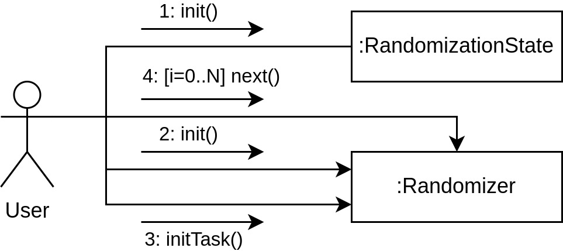

# randeer

<p align="center">
    
</p>

A simple randomization library

## Prerequisites

If you don't have `cmake` installed, install it using the following command:

```sh
sudo apt-get update && sudo apt-get install cmake clangd
```

## Build

### Automatically

To install the application a provided script can be used:

```sh
tools/init.sh
```

After changing the library source code, use `tools/install.sh` script to reinstall the project without regenerating a `Makefile`. Conversely, to generate a `Makefile` without recompiling the project, use `tools/cmake.sh` script.

### Manually

1. Generate a `Makefile`:

```sh
cmake -B build
```

2. Compile and install the library

```sh
sudo make install -C build
```

The library will be available at `/usr/lib/librandeer.so`

## Test

### Automatically

```sh
./tools/test.sh
```

### Manually

After building the project, tests can be run using the following command:

```sh
ctest --test-dir build
```

## Clean up

To delete compiled files, remove the `build` folder. It will be recreated automatically on `Makefile` generation:

```sh
rm -rf build
```

## Architecture

The following UML class diagram contains description of the `randeer/state` subpackage. The subpackage contains classes for representing randomizer state which can be used for sampling integers.



The next UML class diagram demonstrates the implamented randomizers.



The following diagram depicts the structure of the `randeer/utils` subpackage:



There is also a list of functions provided through static library interface. The functions can be grouped by containing file and listed as follows:



The following diagram describes communication between user and system during random numbers generation using objective interface:

<p align="center">
    
</p>
